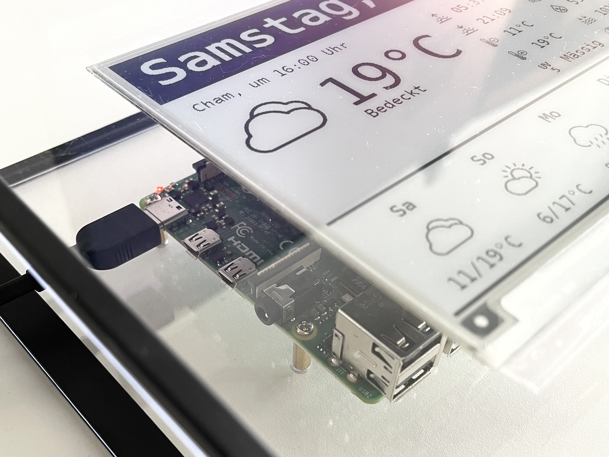
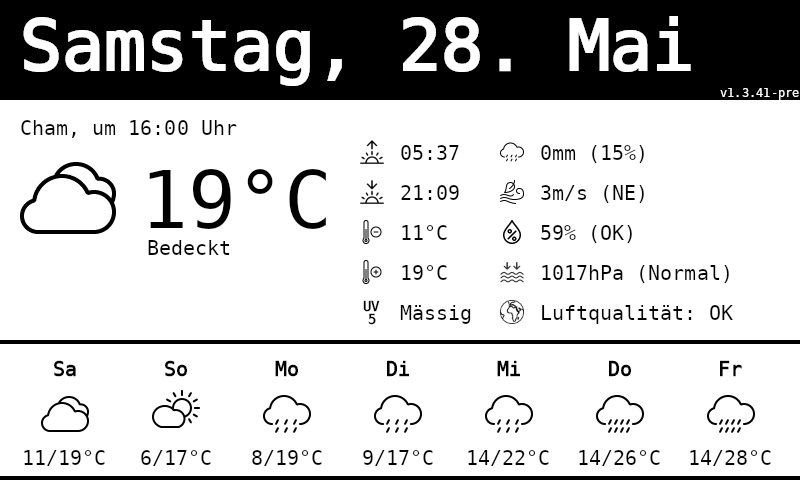

# PiWeatherStation
This is a demo project which uses a Raspberry Pi 4 / Zero 2 to draw some basic weather information to a 7.5" Waveshare ePaper display. The code is based on .NET 6 and there are two runtime projects you can chose from: A console client (WeatherDisplay.ConsoleApp) and an ASP.NET Core Web API (WeatherDisplay.Api).



### Quick Setup
The script file `update_weatherdisplay_api.sh` contains all necessary steps to prepare a new Raspberry Pi to run WeatherDisplay.Api:
- Downloads and installs the .NET SDK.
- Downloads and installs WeatherDisplay.Api as a service unit. 
- Adjusts the Raspberry Pi hardware configuration. (Enables SPI, sets dtoverlays).
- Sets environment variables

Log-in to the Raspberry Pi and run the script file as follows.
```
curl -sSL https://raw.githubusercontent.com/thomasgalliker/PiWeatherStation/develop/WeatherDisplay.Api/Scripts/update_weatherdisplay_api.sh | sudo bash /dev/stdin
```
Append script parameters if needed:
| Parameter | Description |
|---|---|
| `--pre` | Downloads pre-releases of WeatherDisplay.Api. |
| `--debug` | Writes verbose log messages to the console (mainly used for debugging purposes). |
| `--host` | Sets the hostname. By default, a portion of the hardware serial number is used as hostname. The hostname can be changed later. |
| `--keyboard` | Sets the keyboard layout (e.g. "us" or "de"). |
| `--locale` | Sets the localization/language. |
| `--timezone` | Sets the timezone. |
| `--no-reboot` | After the setup, a full reboot cycle is required. This parameter suppresses the reboot. This is mainly used of debugging purposes. |

```
curl -sSL https://raw.githubusercontent.com/thomasgalliker/PiWeatherStation/develop/WeatherDisplay.Api/Scripts/update_weatherdisplay_api.sh | sudo bash /dev/stdin --debug --pre
```

### Extended Setup / Troubleshooting
The following steps are fully automated in `update_weatherdisplay_api.sh`. Follow these steps if the update script cause troubles.

#### Prepare the Raspberry Pi
- Before we install any additional library, make sure the Raspberry OS as well as the installed libraries are on the latest stable releases.
`apt update` updates the package sources list to get the latest list of available packages in the repositories.
`apt upgrade` updates all the packages presently installed in our Linux system to their latest versions.
```
sudo apt update
sudo apt upgrade
```

- Install the GDI+ library. This library is later used to render images via SkiaSharp.
```
sudo apt-get install -y libgdiplus
```

- Reboot the system.
```
sudo reboot
```

- Set correct timezone. Run command `timedatectl list-timezones` in order to find your timezone.
```
sudo timedatectl set-timezone Europe/Zurich
```

#### Install .NET on Raspberry Pi
- Go to Microsoft's [dotnet download page](https://dotnet.microsoft.com/en-us/download/dotnet/6.0) and download the appropriate version of .NET. I usually use the 32bit Version of Raspbian OS, so the appropriate .NET architecture should be ARM32.
- The following dotnet-install.sh script simplifies the automated installation of dotnet on Linux:
```
curl -sSL https://dot.net/v1/dotnet-install.sh | sudo bash /dev/stdin --version latest --channel 6.0 --install-dir /home/pi/.dotnet
```

- Edit the bash profile and add following lines to the end of the file. If `export PATH` already exists, extend it instead of creating a new export. Use `sudo nano ~/.bashrc` to double check if everything is fine.
```
echo 'export DOTNET_ROOT=$HOME/.dotnet' >> ~/.bashrc
echo 'export PATH=$PATH:$HOME/.dotnet' >> ~/.bashrc
```
- Reload the ~/.bashrc file with the command:
```
source ~/.bashrc
```

- Reboot the system.
```
sudo reboot
```

- Run `dotnet --info` to check if your .NET installation works as expected:
```
pi@raspberrypi:~ $ dotnet --info
.NET SDK (reflecting any global.json):
 Version:   6.0.200
 Commit:    4c30de7899

Runtime Environment:
 OS Name:     raspbian
 OS Version:  11
 OS Platform: Linux
 RID:         linux-arm
 Base Path:   /home/pi/.dotnet/sdk/6.0.200/
 ...
```

#### Attach the Waveshare Display & enable GPIO
- Shutdown the the Raspberry using `sudo shutdown -h "now"`. Disconnect the Raspberry from all power sources.
- Attach the Waveshare Display Hat to the GPIO port of the Raspberry. Start the Raspberry up again.
- Edit the [config.txt](https://www.raspberrypi.com/documentation/computers/config_txt.html) in order to enable the SPI interface.
```
sudo nano /boot/config.txt
```

- Enable the SPI interface.
```
dtparam=spi=on
```
- Add this line if you get `IOException: Device or resource busy : '/sys/class/gpio/export'`. More info [here](https://github.com/eXoCooLd/Waveshare.EPaperDisplay/issues/17).
```
#dtoverlay=spi0-1cs,cs0_pin=28
```

- Reboot the system.
```
sudo reboot
```

#### Deploy WeatherDisplay.Api
- Prepare the project folder on the Raspberry Pi:
```
cd ~
mkdir WeatherDisplay.Api
```
- Download the latest stable release from https://github.com/thomasgalliker/PiWeatherStation/releases. Extract the zip to the target directory /home/pi/WeatherDisplay.Api.
- Alternatively, you can build the WeatherDisplay.Api project with `RELEASE` build configuration and copy the binaries to the Raspberry Pi using WinSCP (or any other file transfer tool).
There are also other ways (like `dotnet publish`) to get a set of release-ready binaries.
- Take ownership of the folder and file.
```
sudo chown pi -R /home/pi/WeatherDisplay.Api
```
- Update permissions to allow execution of the executable file `WeatherDisplay.Api`.
```
sudo chmod +x /home/pi/WeatherDisplay.Api/WeatherDisplay.Api
```

- Test the ASP.NET Core web service by starting it manually. (Alternatively, you can also run the executable by calling: `./WeatherDisplay.Api`)
```
dotnet WeatherDisplay.Api.dll
```

#### Create background service for WeatherDisplay.Api
If everything works fine so far, we can setup the WeatherDisplay.Api as a service. This ensures that the display is regularly updated with latest information even if the ssh console is closed. Services are also automatically started if the system is rebooted.
- Navigate to /etc/systemd/system and create a new service definition:

```
sudo nano /etc/systemd/system/weatherdisplay.api.service
```

- Create a service definition which automatically starts the web API service when the operating system is started.
```
[Unit]
Description=WeatherDisplay.Api
After=network-online.target firewalld.service
Wants=network-online.target

[Service]
Type=simple
WorkingDirectory=/home/pi/WeatherDisplay.Api
ExecStart=sudo /home/pi/.dotnet/dotnet /home/pi/WeatherDisplay.Api/WeatherDisplay.Api.dll
ExecStop=/bin/kill $MAINPID
KillSignal=SIGTERM
KillMode=process
SyslogIdentifier=WeatherDisplay.Api
TimeoutStartSec=60
TimeoutStopSec=20

User=pi
Group=pi

Restart=no

Environment=ASPNETCORE_ENVIRONMENT=Production
Environment=DOTNET_PRINT_TELEMETRY_MESSAGE=false
Environment=DOTNET_ROOT=/home/pi/.dotnet

[Install]
WantedBy=multi-user.target
```

Explanations for some of the configuration values:
| Attribute | Description |
|---|---|
| `WorkingDirectory` | Will set the current working directory. |
| `ExecStart` | Systemd will run this executable to start the service. |
| `ExecStop` | Defines the way the service is stopped when systemctl stop is called on this service. Together with KillSignal, this value is responsible for a graceful shutdown. |
| `KillSignal` | Is a very important value to determine how the ASP.NET Core web service is stopped. If the wrong value is used, the service is killed without gracefully shutting down it's services (e.g. BackgroundService, IHostedService, IDispose, etc). |
| `KillMode` | Setting KillMode to process instead of control-group (default) allows to shutdown the main process and spawn new processes (e.g. for automatic update service). |
| `SyslogIdentifier` | Primary identifier of this service. This name is used to run systemctl start/stop operations as well as to read the service log (journalctl). |
| `Restart` | Ensure the service restarts after crashing. Takes one of no, on-success, on-failure, on-abnormal, on-watchdog, on-abort, or always. |
| `RestartSec` | Amount of time to wait before restarting the service. |

- Enable the service definition:
```
sudo systemctl enable weatherdisplay.api
```

- Start the service:
```
sudo systemctl daemon-reload
```
```
sudo systemctl start weatherdisplay.api
```

### Run PiWeatherStation
- Access the API using http://{ip-address-raspberry}:5000/swagger/index.html in order to start the Swagger UI. 
- Use the /login method to authenticate with the API.
- Call any other API method after successful login. 
### Troubleshooting & Maintenance
#### Update and restart the service
If anything in the service definition (weatherdisplay.api.service file) is changed, the service needs to be stopped and restarted.
The same procedure is necessary if we want to re-deploy the WeatherDisplay.Api binaries.

-  Stop the service to release any file locks or http listeners.
```
sudo systemctl stop weatherdisplay.api
```

- Rebuild the web API project and copy the output to the raspberry.
- Restart the weatherdisplay.api.service.
```
sudo systemctl daemon-reload
sudo systemctl start weatherdisplay.api
```

#### Service Operations
```
sudo systemctl start weatherdisplay.api
sudo systemctl stop weatherdisplay.api
sudo systemctl restart weatherdisplay.api
```

#### Check Service Log
```
journalctl -u weatherdisplay.api.service -f -n 40 -o short-iso-precise
```

#### Check Listening Network Ports
```
sudo netstat -tulpn | grep LISTEN
```

#### Call URL using cURL
```
curl -I -k https://localhost:5000/swagger/index.html

HTTP/2 200
content-type: text/html
date: Wed, 23 Feb 2022 16:35:52 GMT
server: Kestrel
accept-ranges: bytes
etag: "1d7c28cf574c2b4"
last-modified: Sat, 16 Oct 2021 12:54:30 GMT
content-length: 1460
```

### Images
- Weather Display Rendering Image


- Weather Display Photo


### Links
#### Similar projects / Waveshare / IoT
- https://github.com/eXoCooLd/Waveshare.EPaperDisplay
- https://github.com/thecaptncode/IoTDisplay
- https://www.youtube.com/watch?v=t-rFj54BsDI
- https://github.com/Tharnas/EInkDisplayService
- https://github.com/bezysoftware/crypto-clock


#### Raspberry Pi Resources
- https://www.raspberrypi.com/documentation/computers/raspberry-pi.html
- https://desertbot.io/blog/headless-pi-zero-ssh-access-over-usb-windows
- https://www.petecodes.co.uk/install-and-use-microsoft-dot-net-6-with-the-raspberry-pi/

#### Microsoft .NET
- https://docs.microsoft.com/en-us/dotnet/iot/deployment
- https://docs.microsoft.com/en-gb/dotnet/core/install/linux-scripted-manual#scripted-install
- https://docs.microsoft.com/en-gb/dotnet/core/tools/dotnet-install-script

#### Linux and ASP.NET Core related sources
- https://swimburger.net/blog/dotnet/how-to-run-a-dotnet-core-console-app-as-a-service-using-systemd-on-linux
- https://swimburger.net/blog/dotnet/how-to-run-aspnet-core-as-a-service-on-linux
- https://docs.microsoft.com/en-us/troubleshoot/developer/webapps/aspnetcore/practice-troubleshoot-linux/2-6-run-two-aspnetcore-applications-same-time
- https://procodeguide.com/programming/how-to-set-start-url-in-aspnet-core/
- https://docs.microsoft.com/en-us/aspnet/core/fundamentals/servers/kestrel/endpoints?view=aspnetcore-6.0
- https://richstokoe.com/2017/12/10/running-asp-net-core-raspbian-linux-raspberry-pi-https/
- https://github.com/alastairgould/dotnet-core-systemd/blob/7eb500a1f1ffe4e27278edb14ef85fb0a11bf8bf/webapplication.service
- https://dejanstojanovic.net/aspnet/2018/june/clean-service-stop-on-linux-with-net-core-21/

#### OpenWeatherMap API
- https://openweathermap.org/weather-conditions
- https://openweathermap.org/api
- http://snowfence.umn.edu/Components/winddirectionanddegrees.htm

#### BME680
- https://www.laub-home.de/wiki/Raspberry_Pi_BME680_Gas_Sensor

#### Linux Shell Scripts
- https://stackoverflow.com/questions/192249/how-do-i-parse-command-line-arguments-in-bash
- 
#### Other sources
- https://github.com/angelobreuer/OpenWeatherMap4NET
- https://github.com/Violetta-9/Weather/tree/master
- https://openweathermap.org/weather-conditions
- https://www.meteoschweiz.admin.ch/home/service-und-publikationen/beratung-und-service/meteoschweiz-app.html
